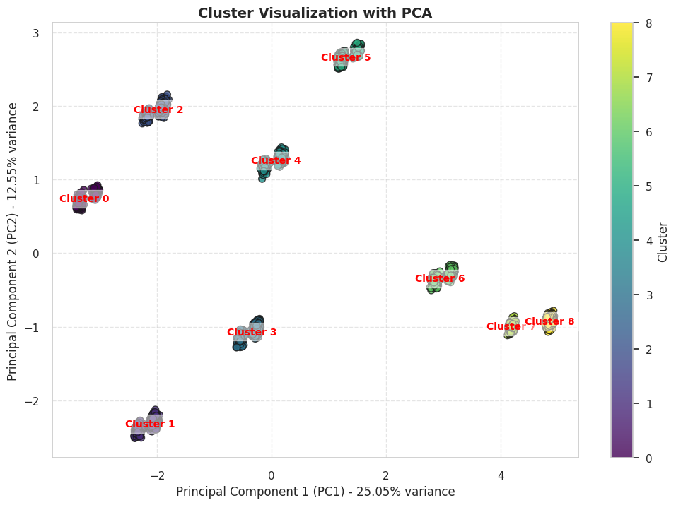
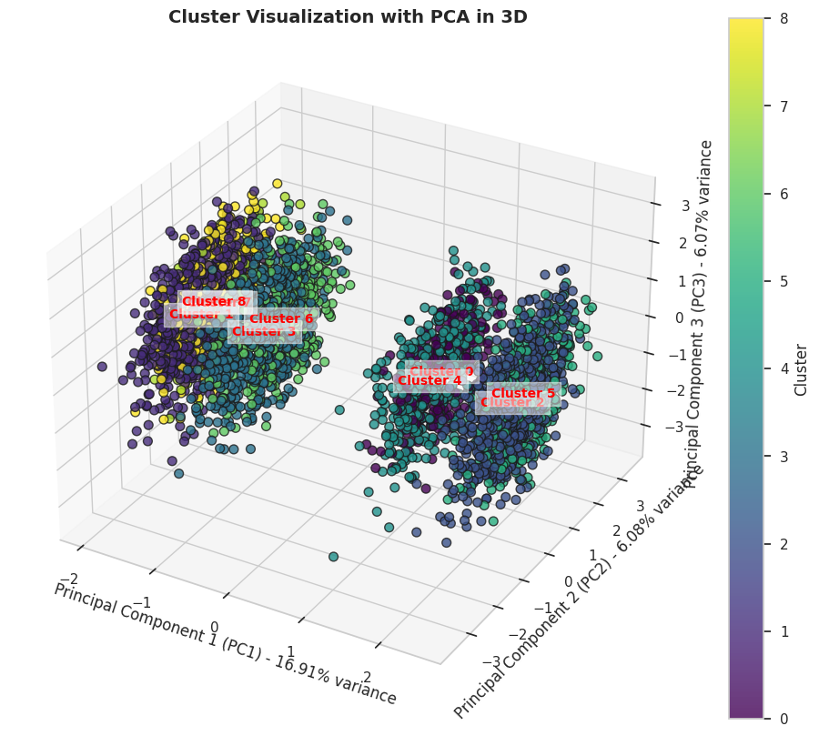

# Customer Segmentation
# Customer Shopping Trends - Clustering and Classification Project

This project analyzes customer shopping behavior using clustering and classification techniques. The dataset contains information about customer preferences and behaviors, which is useful for businesses to understand their customer base and make data-driven decisions. The goal of this project is to apply clustering to group customers based on their shopping preferences and then use classification models to predict customer behaviors.

## Project Overview

The project is divided into two main tasks:
1. **Clustering**: Grouping customers based on their shopping behavior using clustering algorithms.
2. **Classification**: Using the labels generated from clustering to predict customer behavior using different classification models.

### **Dataset Used**
The dataset used in this project is the [Customer Shopping Trends Dataset](https://www.kaggle.com/datasets/iamsouravbanerjee/customer-shopping-trends-dataset). This dataset contains various features related to customer shopping preferences, such as:
- Age, gender, and location of the customer.
- Items purchased, the amount spent, and the season of purchase.
- Customer feedback, frequency of purchases, and payment methods.

#### **Dataset Features:**
- **Customer ID**: Unique identifier for each customer.
- **Age**: Age of the customer.
- **Gender**: Gender of the customer (Male/Female).
- **Item Purchased**: The item purchased by the customer.
- **Category**: Category of the item purchased.
- **Purchase Amount (USD)**: The amount of the purchase in USD.
- **Location**: Location where the purchase was made.
- **Size**: Size of the purchased item.
- **Color**: Color of the purchased item.
- **Season**: Season during which the purchase was made.
- **Review Rating**: Rating given by the customer for the purchased item.
- **Subscription Status**: Indicates if the customer has a subscription (Yes/No).
- **Shipping Type**: Type of shipping chosen by the customer.
- **Discount Applied**: Indicates if a discount was applied to the purchase (Yes/No).
- **Promo Code Used**: Indicates if a promo code was used for the purchase (Yes/No).
- **Previous Purchases**: The total count of transactions concluded by the customer at the store, excluding the ongoing transaction.
- **Payment Method**: Customer's most preferred payment method.
- **Frequency of Purchases**: Frequency at which the customer makes purchases (e.g., Weekly, Fortnightly, Monthly).

#### **Number of Records**:
- The dataset contains **3900 records** that can be used to analyze various patterns in customer shopping behavior.

## **Objectives**
- **Clustering**: To segment customers into distinct groups based on their shopping behaviors using unsupervised learning.
- **Classification**: To classify customer behavior using different machine learning models based on the clusters generated in the previous step.

## **Clustering Results**
For clustering, I have implemented feature selection to improve the quality of clustering. The silhouette score achieved with the selected features was **0.75**, indicating well-defined clusters.

## **Classification Results**
The classification models used in this project are:
1. **SVM (Support Vector Machine)** - Accuracy: **100%**, Precision: **100%**, Recall: **100%**, F1-Score: **100%**
2. **Random Forest** - Accuracy: **100%**, Precision: **100%**, Recall: **100%**, F1-Score: **100%**
3. **K-Nearest Neighbors (KNN)** - Accuracy: **81.41%**, Precision: **80.71%**, Recall: **81.41%**, F1-Score: **80.18%**
4. **Decision Tree** - Accuracy: **100%**, Precision: **100%**, Recall: **100%**, F1-Score: **100%**

## **Models Evaluation**
The classification models were evaluated using accuracy, precision, recall, and F1-score. Models such as SVM, Random Forest, and Decision Tree performed exceptionally well with 100% accuracy, while KNN showed a relatively lower performance.

## **Project Files**
The following files are included in this repository:
- **Clustering Notebook**: `Clustering_Submission_BMLP_YourName.ipynb`
- **Classification Notebook**: `Klasifikasi_Submission_BMLP_YourName.ipynb`
- **Dataset for Clustering**: `clustering_dataset.csv` (dataset without labels)
- **Dataset for Classification**: `classification_dataset.csv` (dataset with labels from clustering)

## **Steps Taken in the Project**
1. **Data Preprocessing**: Cleaned the dataset, handled missing values, and applied feature scaling as needed.
2. **Clustering**: Applied K-Means clustering to segment customers based on their shopping behaviors and analyzed the results.
3. **Feature Selection**: Selected the most relevant features for clustering and compared silhouette scores before and after feature selection.
4. **Classification**: Trained four different classification models to predict customer behavior based on the labels generated from clustering.
5. **Model Evaluation**: Evaluated the models using accuracy, precision, recall, and F1-score.

## **Conclusion**
This project successfully segments customers based on their shopping behavior and applies classification models to predict customer behaviors. The results show that some models, like Random Forest and SVM, perform excellently in terms of both accuracy and F1-Score. This analysis can be useful for businesses to tailor marketing strategies and understand customer preferences better.

